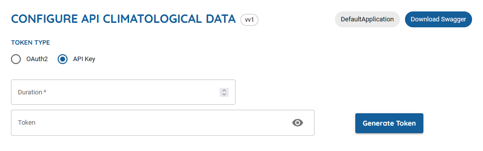

This is a script to download all historical snow and wind data hosted by M&eacute;t&eacute;o-France. M&eacute;t&eacute;o-France is the official meteorological organization for France. This README file details how to create an API key for M&eacute;t&eacute;o-France's API and how to use this script to download data.

### Required packages

To install required packages, run the following command.

```
pip install -r requirements.txt
```

### How to create a new API key

Access to the API requires using an email address to create an account. An account can be created by clicking the *Subscribe to the API for free* button on the [API portal sign-in page](https://portail-api.meteofrance.fr/web/en/api/DonneesPubliquesClimatologie) and filling out the form. Once this is done, return the the sign-in page and click the *Use* button. This will redirect to a [Swagger UI](https://portail-api.meteofrance.fr/web/en/api/test/a5935def-80ae-4e7e-83bc-3ef622f0438d/949fcf2b-f2ed-48f8-9e57-c768ca285686) page for M&eacute;t&eacute;o-France's climatology API. Once on the Swagger UI page, an API key can be generated from the climatology API portal. In the box titled *Configure API Climatological Data*, select the *API Key* button, enter the number of seconds you wish the API key to be valid into the *Duration* box, and click the *Generate Token* button. This will populate a token in the *Token* box. Copy the token and paste it into a file called ".token" in the same directory as this README file. (You may need to unhide the key by clicking the *eye* button before copying the token.)



### How to use this script to download data

This script can download all historical snow or wind data. To run the program, run one of the following commands in the command line.

```
python main.py snow
python main.py wind
```
